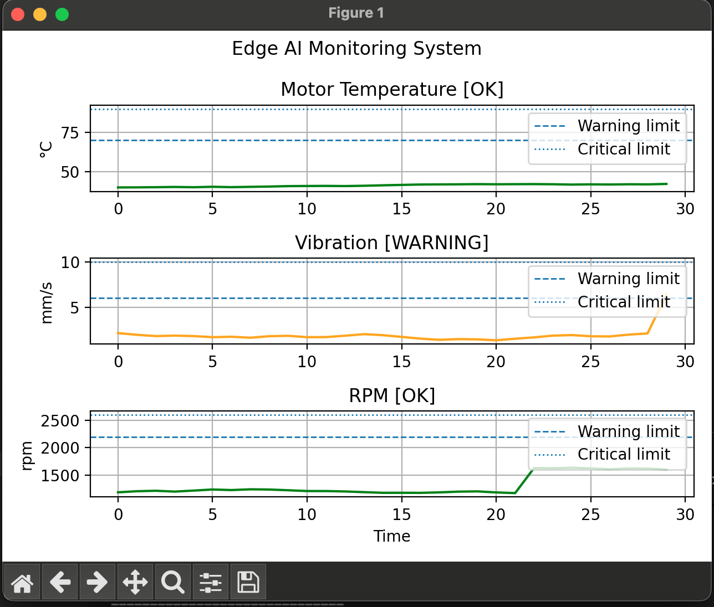

# Edge AI Monitor

Author: Nadim Tali  
Electrical Engineering Student – Microelectronics Specialization

Real-time embedded monitoring and anomaly detection prototype built with Python.



---

## Overview

This project simulates an edge AI monitoring system that continuously tracks sensor data in real time and detects abnormal operating conditions using lightweight processing algorithms.

The system monitors:
- Motor temperature
- Vibration levels
- RPM (rotational speed)

The platform includes:
- Real-time live plotting
- Threshold-based anomaly detection
- Statistical anomaly detection using rolling mean, standard deviation, and z-score analysis
- Moving average filtering
- Sensor event logging
- CSV telemetry recording
- Modular software architecture

---

## Technologies Used

- Python
- Matplotlib
- NumPy
- CSV logging
- Object-oriented programming

---

## System Architecture

```text
Sensors → Signal Processing → Threshold Detection
        → Statistical AI Detection
        → Event Logger
        → Live Visualization
```
## Project Structure:
```text

edge-ai-monitor/
│
├── src/
│   ├── detection/
│   ├── sensors/
│   ├── utils/
│   └── visualization/
│
├── assets/
├── logs/
├── main.py
├── config.py
└── requirements.txt
```

## How to Run:
```text

Clone the repository:
git clone https://github.com/nadimtali/edge-ai-monitor.git
cd edge-ai-monitor

Install dependencies:
pip install -r requirements.txt

Run the monitor:
python main.py
```
